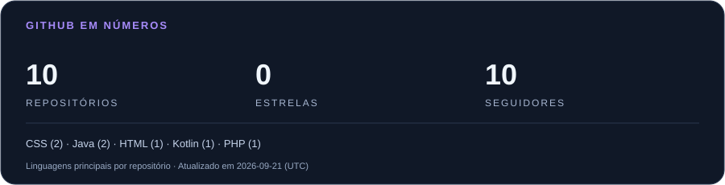
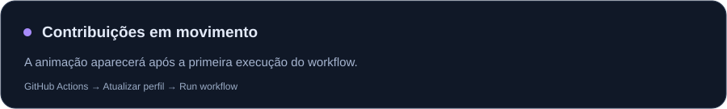

  

  <a href="#sobre-mim">Sobre mim</a> &nbsp; · &nbsp;
  <a href="#tecnologias">Tecnologias</a> &nbsp; · &nbsp;
  <a href="#meus-repositórios">Repositórios</a> &nbsp; · &nbsp;
  <a href="#atividade">Atividade</a> &nbsp; · &nbsp;
  <a href="#vamos-conversar">Contato</a>

## Sobre mim

Oi! Eu sou o **Gustavo Lacerda**, estudante de **Desenvolvimento de Sistemas na ETEC Zona Leste**.

Este é meu espaço para reunir código, estudos e experiências com desenvolvimento e design. Por aqui, você encontra os repositórios que fazem parte da minha jornada de aprendizado.

> Código para construir. Design para comunicar. Aprendizado para evoluir.

## Tecnologias

**Desenvolvimento**

  
  
  
  
  

**Design e ferramentas**

  
  
  
  

## Meus repositórios

Explore meus códigos por linguagem:

| Web | Java | Python |
| :--- | :--- | :--- |
| [Projetos com JavaScript ↗](https://github.com/ggustavo-lac?tab=repositories&language=javascript) | [Projetos com Java ↗](https://github.com/ggustavo-lac?tab=repositories&language=java) | [Projetos com Python ↗](https://github.com/ggustavo-lac?tab=repositories&language=python) |

**[Ver todos os repositórios →](https://github.com/ggustavo-lac?tab=repositories)**

## Atividade

  
<strong>Veja minhas contribuições ganharem movimento 🐍</strong>

   
  <picture>
    <source media="(prefers-color-scheme: dark)" srcset="assets/snake-dark.svg" />
    
  </picture>

O resumo considera repositórios públicos próprios, sem forks. As linguagens são contadas pela linguagem principal de cada repositório; não representam nível de domínio.

## Vamos conversar

  
  
  

[Instagram](https://www.instagram.com/guh.lacerdaa/) · [gustavo4kps4@gmail.com](mailto:gustavo4kps4@gmail.com) · [E-mail da ETEC](mailto:gustavo.brito62@etec.sp.gov.br)

 

  

